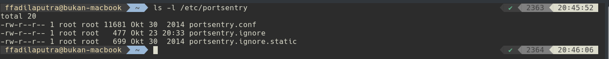
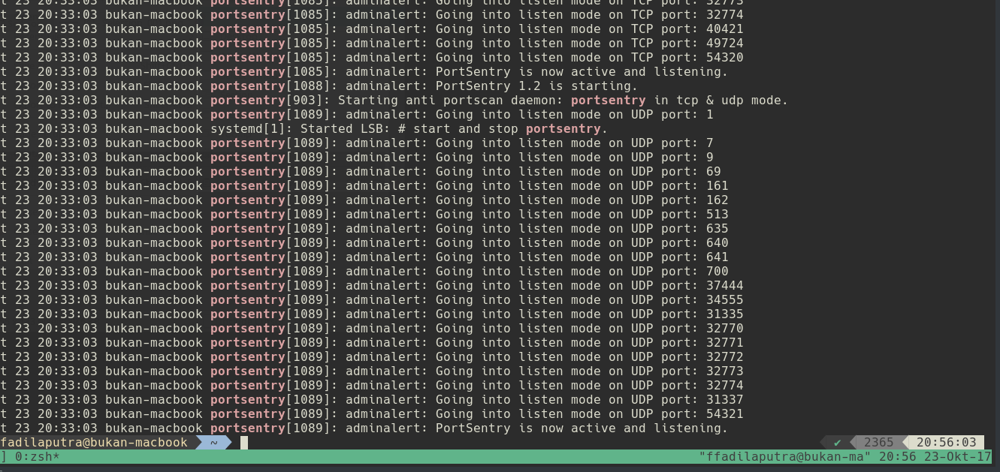
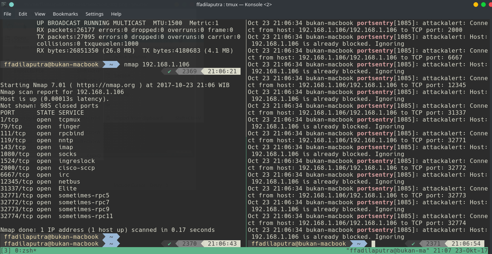

# Kuliah Network Security

:shell: Kuliah Network Security

### Instalasi Portsentry

Pada kasus ini kami menggunakan os ubuntu untuk menggunakan portsentry , pastikan paket sudah ada di repository
```
sudo apt-get update
sudo apt-get install portsentry
```
Setelah instalasi portsentry selesai , maka akan memiliki beberapa konfigurasi file 



 - portsentry.conf This is the PortSentry configuration file.
 - portsentry.ignore , This file contains a list of IP addresses that PortSentry should ignore if it connects to a monitored port
 - portsentry.ignore.static , portsentry.ignore is rebuild on each start of the daemon using portsentry.ignore.static and all the IP addresses found on the machine via 
 
 ### Melihat log pada Portsentry

 

 ```
 grep portsentry /var/log/syslog
 ```
Command diatas dipakai untuk melihat log yang terdapat pada syslog , apabila ingin ditampilkan pada suatu file agar dapat dilihat lebih jelas maka menggunakan perintah

```
grep portsentry /var/log/syslog > nama_file.txt
```

### Penggunaan Service 
Untuk memulai service portsentry

```
service portsentry start
```
Untuk mematikan service portsentry
```
service portsentry stop
```
Untuk restart service portsentry
```
service portsentry restart
```
Untuk melihat status portsentry
```
service portsentry status
```

### Testing Menggunakan Nmap

Instalasi nmap terlebih dahulu
```
sudo apt-get install nmap
```
Kemudian masukkan ip yang akan diuji
```
nmap ip_yang_dituju
```
Lihat pada log host yang dilakukan nmap tadi
```
 grep portsentry /var/log/syslog
```
Hasil log setelah dilakukan nmap akan dideteksi sebagai serangan 




